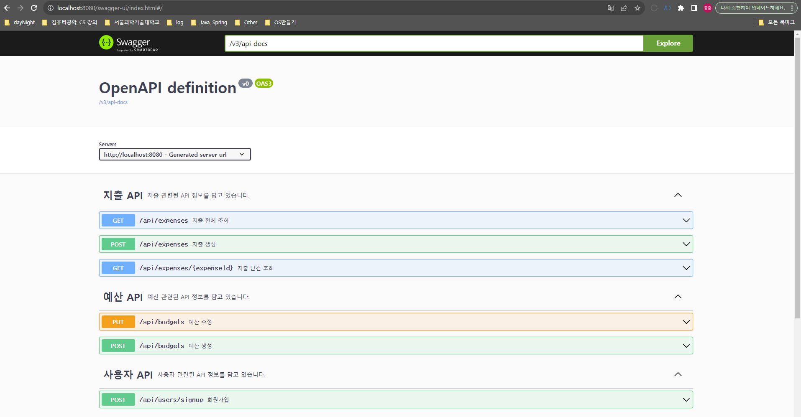
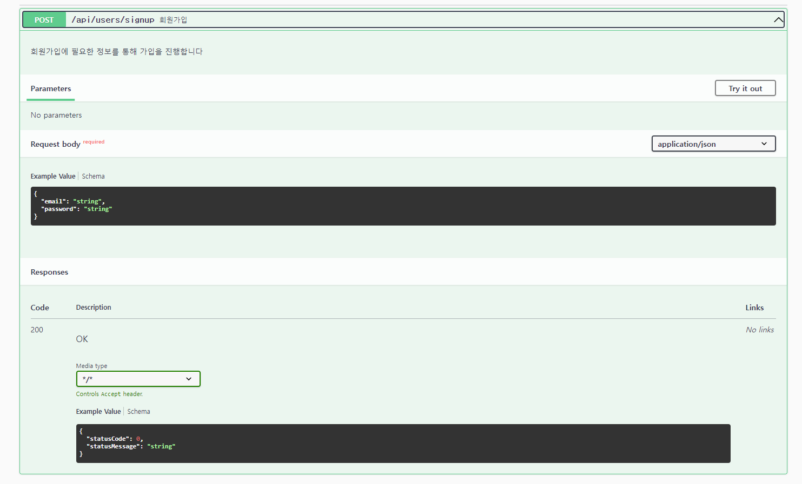
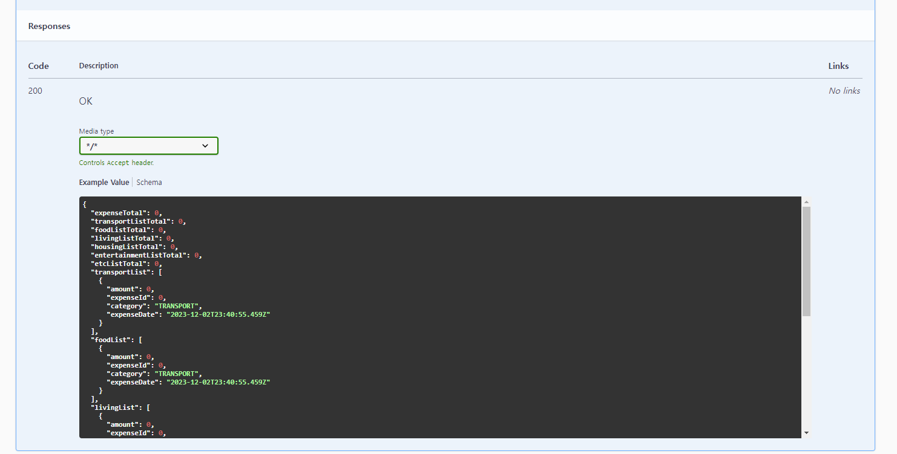
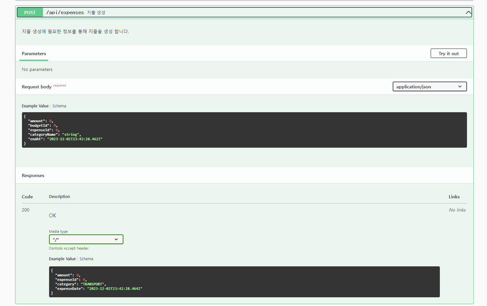
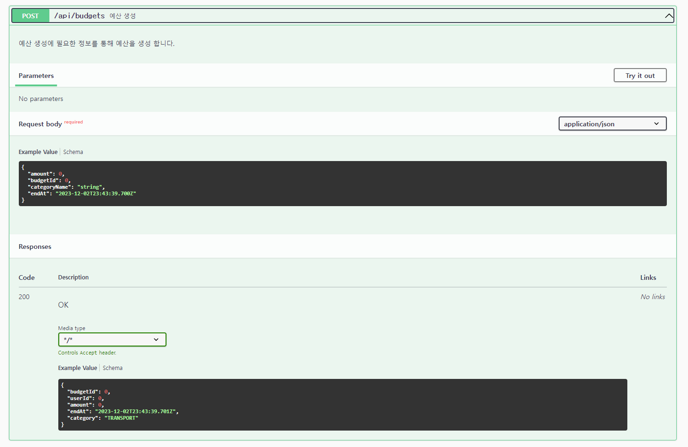
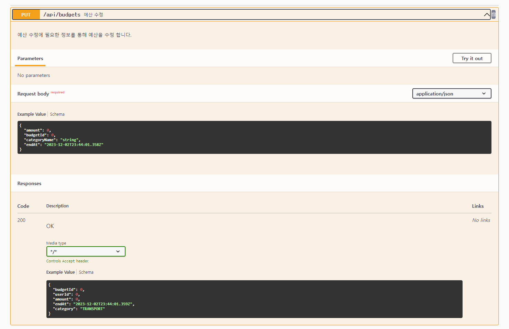
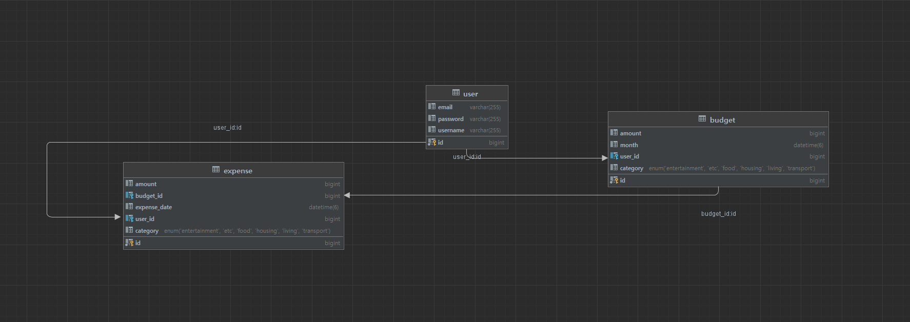

# 예산 관리 어플리케이션

<br/>

## Table of Contents

- [개요](#개요)
- [Skils](#skils)
- [Installation](#Installation)
- [API Reference](#api-reference)
- [프로젝트 진행 및 이슈 관리](#프로젝트-진행-및-이슈-관리)
- [구현과정(설계 및 의도)](<#구현과정(설계-및-의도)>)
- [TIL 및 회고](#til-및-회고)
- [Authors](#authors)
- [References](#references)

<br/>

## 개요

본 서비스는 사용자들이 개인 재무를 관리하고 지출을 추적하는 데 도움을 주는 애플리케이션입니다. 이 앱은 사용자들이 예산을 설정하고 지출을 모니터링하며 재무 목표를 달성하는 데 도움이 됩니다.

**(지출을 추적한 결과를 토대로 지출 통계 기능을 지원합니다)**


## Skils

<div align="center">

언어 및 프레임워크 <br/>   
<br/>
데이터 베이스 <br/><br/>

</div>

## Installation


```bash
  # 설치
  git clone .git
  
  # 실행
  ./gradlew build -x test
  
  # 파일위치로 이동 후
  javac .java
```

## Directory

<details>
<summary> 파일 구조 보기 </summary>

```
src
├─common
│  ├─config
│  ├─dto
│  ├─entity
│  ├─error
│  └─exception
├─user
│  ├─controller
│  ├─dto
│  ├─entity
│  ├─repository
│  └─service
├─budget
│  ├─controller
│  ├─dto
│  ├─entity
│  ├─repository
│  └─service
├─expense
│  ├─controller
│  ├─dto
│  ├─entity
│  ├─repository
│  └─service
└─util
    └─CustomResponseUtil
```

</details>
<br/>

## API Reference

Swagger : http://localhost:{port}/swagger#/

<details>

<summary>Swagger - click</summary>






</details>

<br/>

## 프로젝트 진행 및 이슈 관리


<br/>

## 구현과정(설계 및 의도)

ERD



[budget_management_erd](https://lucid.app/lucidchart/7e0d6cd7-f045-4cf3-a526-aa78cac905e9/edit?invitationId=inv_ad8e0887-5199-422a-9883-4de20341c21e&page=0_0#)

<details>
<summary>entity 설계 시 고려사항- click</summary>

- 주요 도메인으로 user, expense, budget, category 으로 나눈다
    - 변경 : category 는 budget 도메인에서 enum으로 관리한다
        - 이유 : 사용자가 원하는 카테고리를 생성한다는 조건이 있었으면 category를 다대다로 두어 관리 할텐데
        - 이미 카테고리는 정해져있다고 요구사항에 명시되어있었으므로 다대다로 하게되면 개발 비용만 증가한다고 생각
- 요구사항으로 JWT를 통해 유효성을 검증한다는 내용이 있음
    - 이에 대해 JWT와 세션을 함께 구현할까 고민하였지만 우선순위가 아니므로 추후 시간이 남으면 개발
    - JWT를 통해 회원을 식별
- Expense와 Budget 관계
    - expense는 budget의 상속관계로 설정한다. 이유는 expense(지출)은 budget(예산) 내에서 사용이 가능하기 때문이다.
    - 변경 : 상속관계로 하지 말고 예산을 차감 or 지출 발생시 예산을 초과하는지 check 하는 방법으로 변경
        ~~- 추가로 고려할 사항 expense와 budget의 상속관계가 서로 바뀌어야 할까? 왜냐하면 지출 기준으로 서비스가 동작하므로 ?~~
~~- Category와 Budget 은 N 대 N 관계로 설정한다.~~
    - 1(카테고리) 대 N(예산) 관계가 아닌가 ? 왜냐하면 예산별로 카테고리를 가지므로
        - 아니다 하나의 예산이 카테고리를 가지고 또 그 카테고리들은 여러개의 예산에 속할 수 있으므로 N 대 N 관계가 성립되어야 한다.

</details>

<br/>

## 코드리뷰 및 에러 해결

### 로그인 회원가입
- [로그인](https://github.com/rivkode/budget_management/pull/7)

### 지출 조회
- [지출 조회](https://github.com/rivkode/budget_management/pull/10)

<br/>

## 로직 수행 과정

**로그인**

> login 과정
> 
> 1. post users/login 로 loginRequest 내용으로 요청
> 2. 서버는 해당 요청을 JwtAuthenticationFilter에서 인터셉트함 (해당 필터는 UsernamePasswordAuthenticationFilter를 상속받음)
> 3. JwtAuthenticationFilter 에서 attempAuthentication메서드는 ObjectMapper의 readValue를 사용하여 사용자 정보를 얻어옴

아래는 자세한 내용

UsernamePasswordAuthenticationFilter에서 attemptAuthentication() 를 override 받아 사용,

이 메서드는 HttpServletRequest 가 post인지 체크, request로 부터 username, password도 얻어옴

그리고 성공시와 실패시 로직을 override 하여 구현하였는데 이 부분은 UsernamePasswordAuthenticationFilter부분이 아닌 AbstractAuthenticationProcessingFilter부분을 override 한 것임

**successfulAuthentication의 경우**

email을 autentication에서 가져온뒤 email 내용을 통해 jwt를 생성하고 header에 추가한다 header에 세팅할때는 Prefix에 Bearer과 token을 넣어준다
그리고 status와 content Type을 지정해주며 ObjectMapper를 통해 바디에 login success를 지정해준다

**unsuccessfulAuthentication의 경우**

- jwt 생성과정을 생략하고 status와 contentType을 지정한다
- ObjectMapper를 통해 바디에 login failure 를 지정해준다

이렇게 되면 users/login 으로 요청시 위 과정을 거치게 되어 email 의 진위에 따라 token 발급이 성공 혹은 실패로 진행된다.
- 언제, 어떤 조건으로 success, unsuccess 메서드를 호출하는지, 즉 진행하게되는지를 추가적으로 알아보자

## 토큰 인증

### JwtAythorizationFilter

- 위 필터는 매 요청시 마다 1번씩 검증을 진행하는 필터
- spring security를 통해 요청이 진행됨
- OncePerRequestFilter 상속받았기 때문

### doFilterInternal

1. HttpServletRequest에서 header로부터 토큰을 가져옴
2. 이 가져온 토큰에서 검증, 사용자 정보, 사용자정보를 인증객체에 담는 과정을 진행함

여기서 각각 과정을 살펴보겠음

**검증 notValidate()**

- servletRes 와 token을 인자로 입력받아서 진행 validateToken 메서드에서는 tokenValue를 입력받고 try문으로 Jwts.parserBuilder()를 통해 생성하고 parseClaimsJws 메서드에서 token을 검증함
- 여기서 발생할 수 있는 예외들을 catch 함
- 그리고 return으로는 boolean 값을 리턴함
- 위 과정이 통과가 안될경우 status = bad , contentType, body = INVALID_TOKEN 로 지정하여 입력받았던 servletRes에서 getOutputStream를 통해 실패 응답을 내보냄
- 그리고 리턴값으로는 true(실패하였기 때문)로 보냄

**사용자 정보 getClaims()**

- SetvletRes와 token을 인자로 입력받음
- jwtUtil의 getUserInfoFromToken() 메서드에서 token 인자를 전달하여 사용자 정보를 얻음
- getUserInfoFromToken() 는 key를 가지고 token 에서 정보를 얻어옴
- 이때 Jwts.parserBuilder()를 통해 parser를 생성하고 parseClaimsJws() 에서 getBody() 를 통해 사용자 정보를 가져옴
- 성공시 해당 info 정보를 반환함
- 위 과정 실패 경우 status = bad , contentType, body = INVALID_TOKEN 로 지정하여 입력받았던 servletRes에서 getOutputStream를 통해 실패 응답을 내보냄

**사용자 정보 인증 객체 담기 userInfoInAuthentication(info)**

- 위 사용자 정보인 info를 인자로 전달받아 setAuthentication() 메서드를 통해 인증객체에 사용자 정보를 담는다
- setAuthentication은 빈 SecurityContext를 생성
- 사용자 정보를 가지고 만든 Authentication 객체를 context에 Authentication을 set 함
- 이 SecurityContext를 SecurityContextHolder에 setContext 하여 인증을 처리한다

> 이렇게 인증객체를 SecurityContextHolder에 담으면 이후에 controller에서 사용자 정보를 @AuthenticationPrincipal UserDetailsImpl userDetails 와 같이 가져올 수 있게된다
> 위 모든 과정은 사용자가 로그인 후 JWT를 가지고 서버로 요청을 할때마다 발생하기 때문에 매번 검증, 인증객체 생성, 처리 등이 진행되므로 위와 같이 사용자 인증 및 처리가 진행된다

## Authors

<div align="center">

<br/>

 </br>
<a href="https://github.com/rivkode">이종훈</a>

</div>
<br/>

## References

- [Awesome Readme Templates](https://awesomeopensource.com/project/elangosundar/awesome-README-templates)
- [Awesome README](https://github.com/matiassingers/awesome-readme)
- [How to write a Good readme](https://bulldogjob.com/news/449-how-to-write-a-good-readme-for-your-github-project)